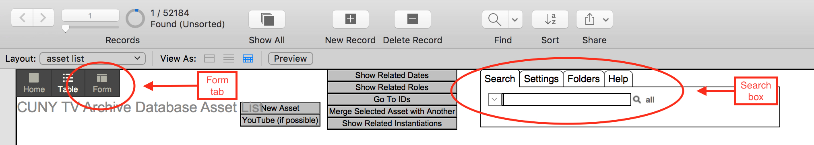
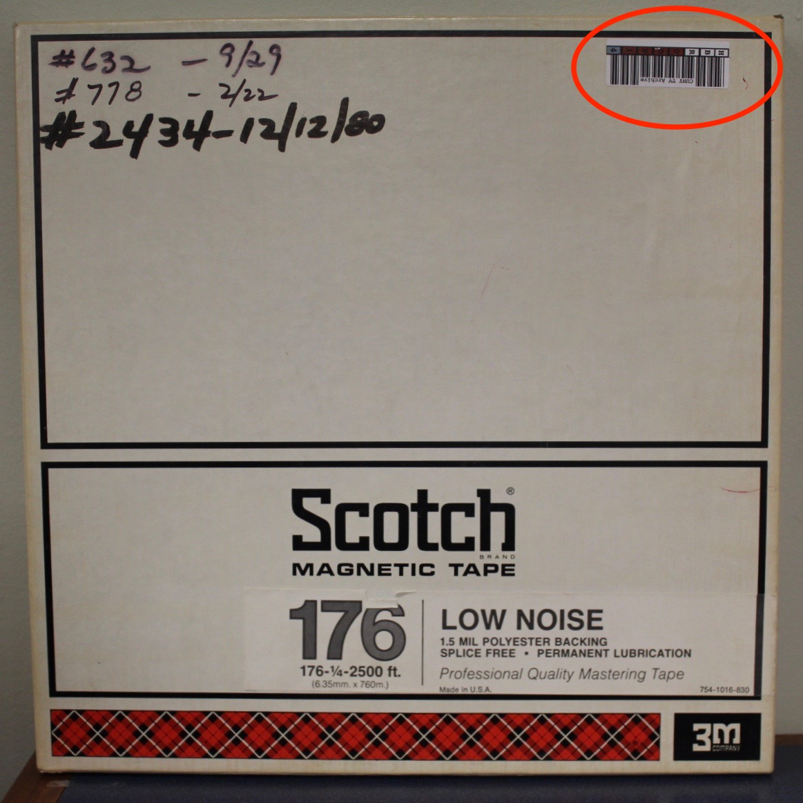
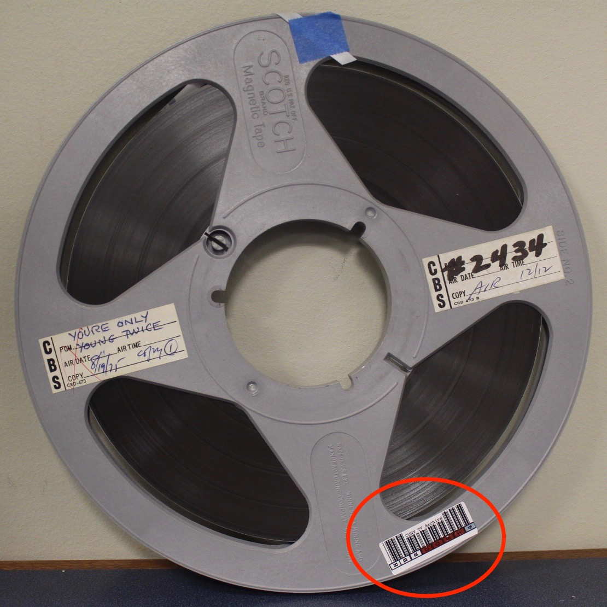

# Barcode workflow. 

## Overview 

Every audio object is assigned a barcode as its identifier.  One copy of the barcode is afixed onto the medium and a second copy is afixed to its container.

The barcodes are afixed:  

* in a location that does not obscure technical information about the media. 
* in a location that does not obscure content information about the program.
* in a location that does not interfere with the functionality of the medium. 

## Workflow
1) In the Filemaker database, do a Title search for the audio object in question. 
  
2)  Select the audio object's record and click on the "Form" view.  

.
  
*Example, Filemaker search and view toolbar*

3) Determine if the audio object has already been assigned a barcode number.   If the object has been pre-assigned a barcode, continue the workflow with that barcode; if no barcode has been pre-assigned, assign a unique barcode to the audio object.
  
*Example, Filemaker record*

.

4) Affix one copy of the barcode to the audio object's container.
  
*Example, container barcode*. 

.  

5) Afiix a second copy of the barcode to media housing (reel, cassette shell, etc.)  
  
*Example, media housing barcode*. 

.
